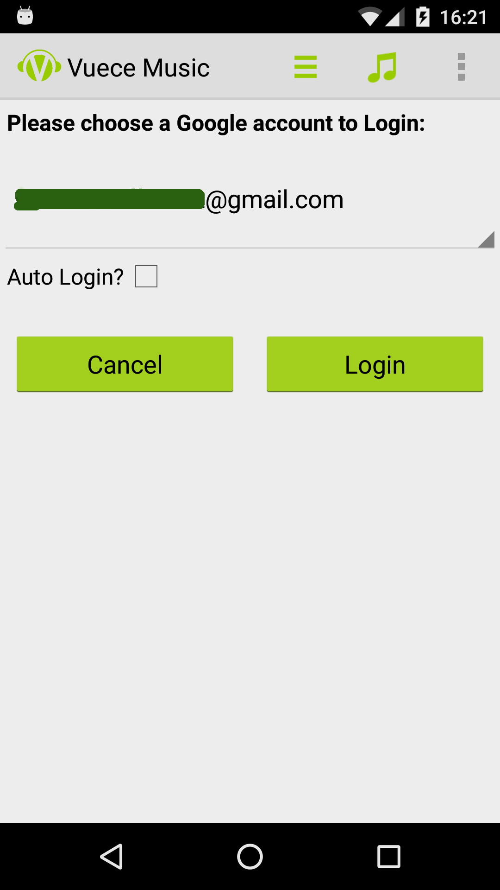
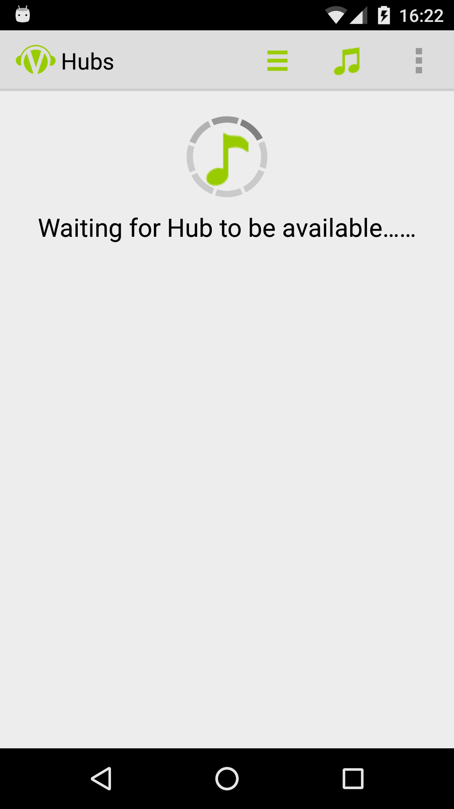
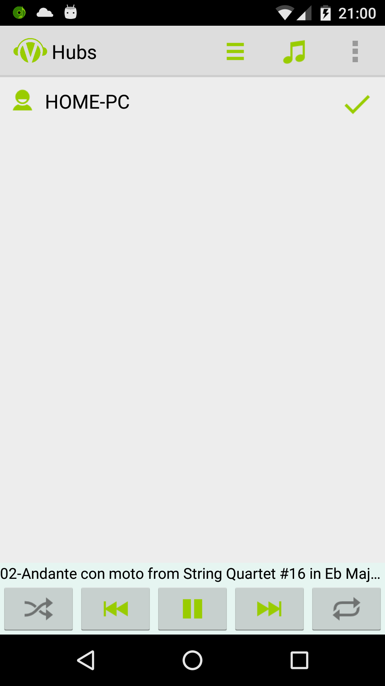
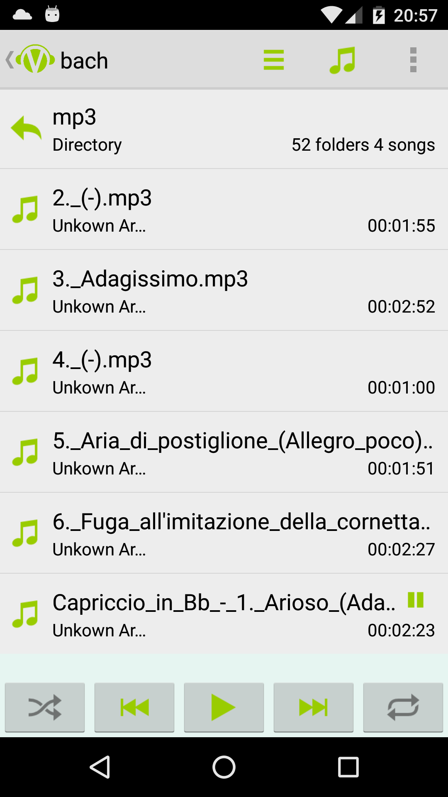
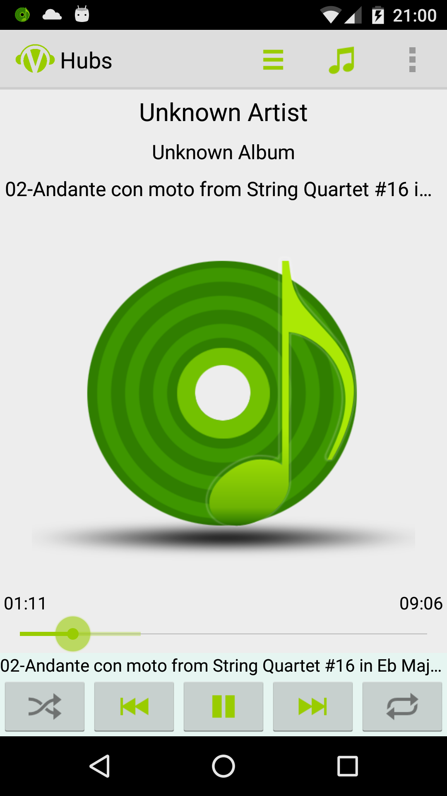
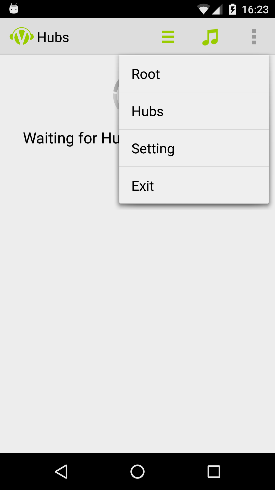

<h1>Vuece Music for Android User Guide</h1>

## Log in

After installing Vuece Music app on your Android phone, run your app, you'll reach the login screen.
  	

    
Veuce Music uses the accounts on your phone to log in. These accounts are all Google accounts. If you can't find the account you want to use, click the dropdown list and select "Add new account..." to add a new one.

## Hub List

After login, you'll see the hub list screen. If no any hub is available, you'll see a waiting screen.

If a hub is available, it will be shown on the screen.

You can go back to the hub list screen any time by selecting "Hubs" in the menu.

If a hub is logged in with the same google account, it will be chosen automatically and the song list screen will be shown.

## Song List

In song list you can browse the folders you have set in your Hub's setting. If you click a song, a song screen will be shown and the song will start to play.

## Song

The Song screen shows the title, the album and the artist of the song on top, and a big photo in the middle. At the bottom there is a slide bar that shows the play progress and streaming progress, and a few buttons to start, stop, go backward, go forward, choose shuffle mode and choose repeat mode. All of these are like standard music player which makes users easy to use.

The control toolbar is also available in Song List screen when a song is playing.

## Menu

A menu is available on the top-right corner.

* Root: goes back to the root of current hub
* Hubs: shows hub list screen
* Setting: shows Settings
* Exit: log out and exit the app
